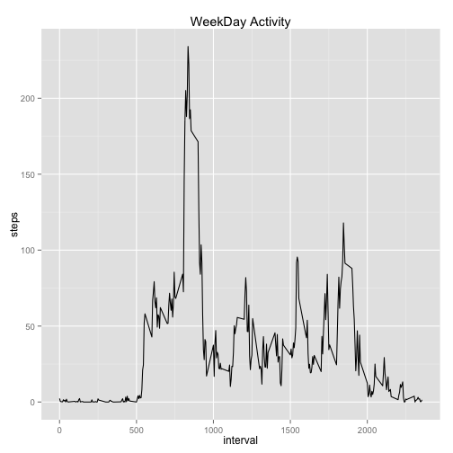
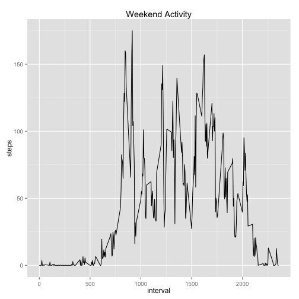

# Reproducible Research: Peer Assessment 1


## Loading and preprocessing the data
Unzip and load the file using read.csv function.Also convert date column as date


```r
unzip(zipfile="activity.zip",overwrite= TRUE)
data<-read.csv(file="activity.csv",header= TRUE)
data$date <- as.Date( data$date,'%Y-%m-%d') 
data$interval <-as.ts(data$interval)
# omiting all missing data
#data<- na.omit(data)
```


## What is mean total number of steps taken per day?
For this we need to summarize the data by day into a new dataset SumData using Summation of steps.


```r
SumData<- aggregate(steps~date,data,FUN=sum)
hist(SumData$steps)
```

 

```r
mean(SumData$steps)
```

```
## [1] 10766
```

```r
median(SumData$steps)
```

```
## [1] 10765
```


## What is the average daily activity pattern?


```r
AvgData <- aggregate(steps~interval,data,FUN=mean)
str(AvgData)
```

```
## 'data.frame':	288 obs. of  2 variables:
##  $ interval: int  0 5 10 15 20 25 30 35 40 45 ...
##  $ steps   : num  1.717 0.3396 0.1321 0.1509 0.0755 ...
```

```r
require(ggplot2)
```

```
## Loading required package: ggplot2
```

```r
require(scales)
```

```
## Loading required package: scales
```

```r
ggplot(data=AvgData,aes(interval,steps)) + geom_line()  
```

 

```r
max(AvgData$steps)
```

```
## [1] 206.2
```

```r
AvgData[AvgData$steps == max(AvgData$steps), ]$interval
```

```
## [1] 835
```


## Imputing missing values


```r
 summary(data)
```

```
##      steps            date               interval   
##  Min.   :  0.0   Min.   :2012-10-01   Min.   :   0  
##  1st Qu.:  0.0   1st Qu.:2012-10-16   1st Qu.: 589  
##  Median :  0.0   Median :2012-10-31   Median :1178  
##  Mean   : 37.4   Mean   :2012-10-31   Mean   :1178  
##  3rd Qu.: 12.0   3rd Qu.:2012-11-15   3rd Qu.:1766  
##  Max.   :806.0   Max.   :2012-11-30   Max.   :2355  
##  NA's   :2304
```

1. The Total number of missing values in dataset for steps column  is  2304

2. imputing missing values  using simple replace with mean of the steps column 


```r
newData <- data 
newData$steps[is.na(newData$steps)] = mean(newData$steps,na.rm = TRUE)
summary(newData)
```

```
##      steps            date               interval   
##  Min.   :  0.0   Min.   :2012-10-01   Min.   :   0  
##  1st Qu.:  0.0   1st Qu.:2012-10-16   1st Qu.: 589  
##  Median :  0.0   Median :2012-10-31   Median :1178  
##  Mean   : 37.4   Mean   :2012-10-31   Mean   :1178  
##  3rd Qu.: 37.4   3rd Qu.:2012-11-15   3rd Qu.:1766  
##  Max.   :806.0   Max.   :2012-11-30   Max.   :2355
```

3. newData has new data with missing values filled in

4. histogram of total number of steps eachday. 

```r
SumData<- aggregate(steps~date,newData,FUN=sum)
hist(SumData$steps)
```

 

```r
mean(SumData$steps)
```

```
## [1] 10766
```

```r
median(SumData$steps)
```

```
## [1] 10766
```

Not much difference in the 2 histograms with and without NA when substitued with mean.
## Are there differences in activity patterns between weekdays and weekends?

We will need to create subsets of data  using weekday() function

```r
require(ggplot2)
require(scales)

WeekdayData <- subset(data,!weekdays(date) %in% c("Saturday","Sunday"))

WeekendData <- subset(data, weekdays(date) %in% c("Saturday","Sunday"))

AvgWeekDay <- aggregate(steps~interval,WeekdayData,FUN=mean)
AvgWeekend <- aggregate(steps~interval,WeekendData,FUN=mean)
 
ggplot(data=AvgWeekDay,aes(interval,steps)) + geom_line()  +  ggtitle("WeekDay Activity")
```

 

```r
ggplot(data=AvgWeekend,aes(interval,steps)) + geom_line() +    ggtitle("Weekend Activity")
```

 

